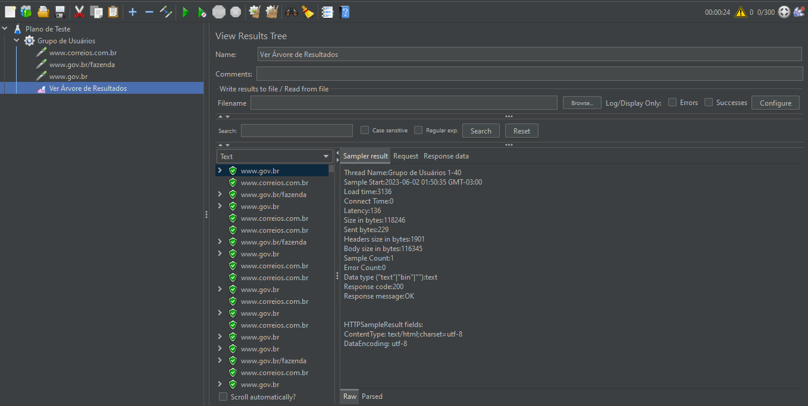

# JMeter - Testes de performance 

 
> JMeter avançado para testes de performance

 Planos de testes realizados durante o curso **JMeter - Testes de performance** da plataforma **Udemy**.
 
## 📚 Tópicos
 
- JMeter - O utilizar
- JMeter - A arquitetura
- JMeter - Os componentes
- JMeter - Criação de scripts de testes automatizados
- PROJETO eCommerce - Criando plano de testes para seu cliente ou empresa
- PROJETO eCommerce - Criando teste para um usuário que navega na loja
- PROJETO eCommerce - Criando teste de um usuário buscando produtos
- PROJETO eCommerce - Criando teste de um usuário realizando compra
- PROJETO eCommerce - Validando ordem de compra
- PERFORMANCE - Testes de performance na prática
- PERFORMANCE - Testes de performance de acordo com as necessidades
- Webservices - Testes para arquitetura REST com GET e POST
- Webservices - Testes para arquitetura SOAP com HTTP POST
- Conceitos - Protocolo HTTP e Status Code
- Conceitos - Indicadores, volumetria e cenários de testes
- Conceitos - Defeitos de testes de performance

## 🔧 Ferramentas e Tecnologias

- JMeter (`v5.5`)

## 🔗 Contato

mykallella@gmail.com
